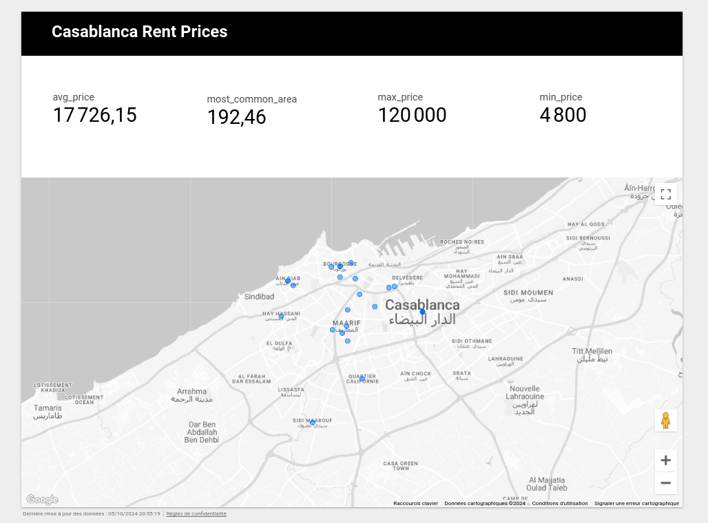

# Casablanca Rental Prices Data Engineering Project

## Project Overview
This project focuses on exploring rental prices in Casablanca by scraping data from real estate websites and creating a data pipeline that stores, transforms, and visualizes the data. The pipeline includes several Google Cloud services for automation and scalability. The final step is creating an interactive dashboard in Looker to analyze and monitor the rental price trends.

## Features
- **Automated Data Scraping**: Scraping rental data from a real estate website using a Python script.
- **Data Pipeline**: A scalable cloud-based pipeline that handles data extraction, transformation, and loading (ETL) using Google Cloud services.
- **Real-Time Data Updates**: Scheduled scraping and data transformation to ensure real-time updates.
- **Visualization Dashboard**: A Looker dashboard that displays key insights and trends in Casablanca’s rental market.

## Tech Stack
- **Scraping**: 
  - Python (for the scraper)
  - Google Cloud Run (for running the scraper)
- **Scheduling**: 
  - Google Cloud Composer (for scheduling scraping jobs)
- **Storage**: 
  - Google Cloud Storage (for storing raw data)
  - BigQuery (for data transformation and analysis)
- **Visualization**:
  - Looker (for building the dashboard)
  
## The Process
1. **Scraping Rental Data**:
   - The Python scraper extracts rental listing data (price, location, property type, etc.) from a real estate website.
   - The scraper is deployed on Google Cloud Run, ensuring scalability and easy execution.

2. **Data Storage**:
   - Scraped data is stored in Google Cloud Storage as raw files for backup and processing.

3. **Data Transformation**:
   - Data is loaded into BigQuery for transformation and cleaning. 

4. **Scheduling**:
   - Google Cloud Composer orchestrates the entire pipeline by scheduling scraping jobs and triggering data transformations.

5. **Data Visualization**:
   - The transformed data is used to create a dynamic dashboard in Looker that provides insights into rental prices, trends, and distributions across Casablanca.

## Architecture
Below is the architecture of the Casablanca Rental Prices Data Engineering Project:

## Final Results
1. **Looker Dashboard**: Provides key insights and trends in rental prices across various neighborhoods in Casablanca.
   

